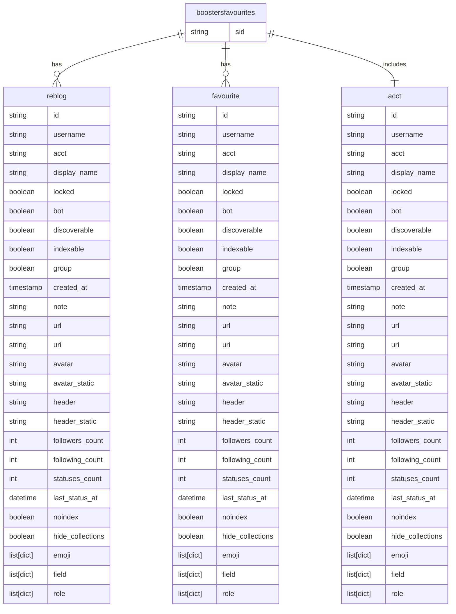
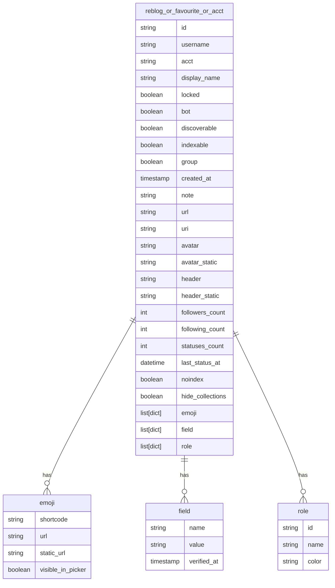
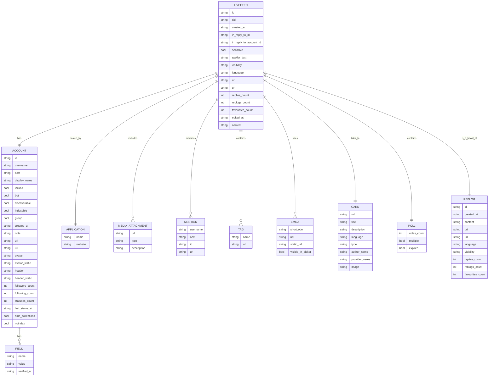
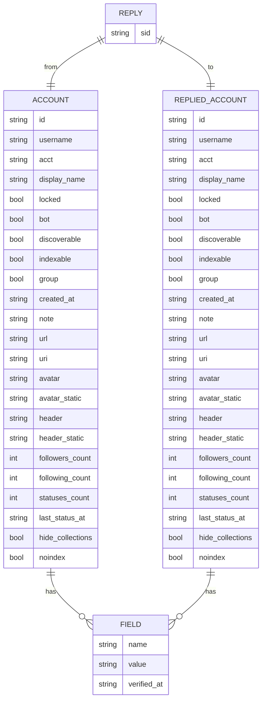

## boostersfavourites.json Description

- 字段结构说明 / Field Structure Overview

    这是一个包含特定 Mastodon 动态（帖子） 在联邦网络中传播轨迹的数据结构，具体字段包括：

    This is a structured object representing the propagation of a specific Mastodon post within the decentralized Fediverse. It includes the following fields:

| 字段名 / Field Name | 类型 / type | 中文说明  | English Description |
| --------------------------------------------------------------------- | ---------- | ------------------- | ------------------- |
| `sid`                                                                 | 字符串 String | 原始帖子的唯一标识符（由 instance + user id 构成） | Unique identifier of the original post (formed by instance + user ID) |            |                                     |
| `reblogs`                                                             | 列表 List    | 所有 **转发（boost）** 该帖子的用户信息 | List of users who boosted the post                                    |            |                                     |
| `favourites`                                                          | 列表 List    | 所有 **点赞（favourite）** 该帖子的用户信息 | List of users who favorited the post                                  |            |                                     |
| `acct`                                                                | 字典 Dict    | 原始发帖用户的账号信息 | Account information of the original poster                            |            |                                     |

- 每个用户对象（reblogs/favourites）的字段说明 / Field Description of Each User Object (in reblogs/favourites)

| 字段名 / Field Name                                                                        | 示例 / Example              | 中文说明                       | English Description |
| -------------------------------------------------------------------------- | ---------------- | ------------------------ | ------------------------ |
| `id`                                                                       | `anon_id_...`    | 匿名化的用户 ID | Anonymized user ID                                                         |                  |                          |
| `username`                                                                 | `anon_name_...`  | 用户名（匿名处理） | Username (anonymized)                                                      |                  |                          |
| `display_name`                                                             | `"thoughtbot"` 等 | 用户公开昵称 | Display name                                                               |                  |                          |
| `note`                                                                     | HTML 格式自我介绍      | 用户兴趣、自我认同、组织归属等 | Self-introduction in HTML, often showing interests, affiliations, identity |                  |                          |
| `followers_count`                                                          | 例如 956           | 粉丝数量（衡量影响力） | Follower count (indicator of influence)                                    |                  |                          |
| `following_count`                                                          | 例如 80            | 关注数量 | Number of users followed                                                   |                  |                          |
| `statuses_count`                                                           | 例如 791           | 总发帖数（活跃度指标）| Total number of posts (activity level)                                     |                  |                          |
| `bot`                                                                      | true / false     | 是否为机器人账户 | Whether the account is a bot                                               |                  |                          |
| `created_at`                                                               | YYYY-MM-DD       | 账号创建时间 | Account creation date                                                      |                  |                          |
| `emojis`                                                                   | 列表 List          | 自定义表情符号，用于展示社群特征 | Custom emojis indicating community traits                                  |                  |                          |
| `fields`                                                                   | 列表（name/value）   | 自定义个人资料字段（如网站、GitHub、位置）| User-defined profile fields (e.g. website, GitHub, location)               |                  |                          |
| `url`, `uri`, `avatar`, `header`                                           | 多为链接             | 用户资料页和媒体头像链接 | Links to profile page and avatar/header images                             |                  |                          |

- acct 字段说明 / Field Description: acct

    字段 acct 是指该条动态的原始发布用户的信息（poster account），结构与 reblogs 和 favourites 中的用户对象一致，字段如下：

| 字段名 / Field Name                | 示例 / Example                | 中文说明                     | English Description                                 |
| ------------------ | ----------------- | ------------------------ | --------------------------------------------------- |
| `id`               | `anon_id_...`     | 用户的匿名化 ID                | Anonymized user ID                                  |
| `username`         | `anon_name_...`   | 用户名（匿名处理）                | Username (anonymized)                               |
| `acct`             | `anon_acct_...`   | 联邦账号名（如 `user@instance`） | Federated account name (e.g., `user@instance`)      |
| `display_name`     | `"balticruby"`    | 显示昵称（通常为组织或用户名）          | Display name (often user/org name)                  |
| `locked`           | `true/false`      | 是否锁定账号（仅允许通过审核后关注）       | Account locked status (requires approval to follow) |
| `bot`              | `true/false`      | 是否为机器人账户                 | Whether this account is a bot                       |
| `discoverable`     | `true/false/null` | 是否可被主动发现                 | Whether discoverable in search/discovery            |
| `indexable`        | `true/false`      | 是否可被搜索引擎索引               | Whether indexable by search engines                 |
| `group`            | `true/false`      | 是否为群组类型账号                | Whether this is a group-type account                |
| `created_at`       | `"YYYY-MM-DD"`    | 账号创建时间                   | Account creation date                               |
| `note`             | HTML 内容           | 用户自我介绍、定位、兴趣等            | User bio in HTML format                             |
| `url`, `uri`       | 链接                | 该账号的主页地址和 URI            | Profile URL and URI                                 |
| `avatar`, `header` | 图片链接              | 用户头像和头图                  | Avatar and header image URLs                        |
| `followers_count`  | 如 `54`            | 粉丝数量                     | Number of followers                                 |
| `following_count`  | 如 `143`           | 关注的用户数量                  | Number of users followed                            |
| `statuses_count`   | 如 `78`            | 发帖总数                     | Total number of statuses/posts                      |
| `last_status_at`   | `YYYY-MM-DD`      | 最后活跃日期                   | Last activity date                                  |
| `hide_collections` | `true/false/null` | 是否隐藏公开收藏                 | Whether public collections are hidden               |
| `noindex`          | `true/false`      | 是否不允许搜索引擎索引              | Search engine indexing preference                   |
| `emojis`           | 列表                | 自定义 emoji 表情             | List of custom emojis                               |
| `roles`            | 列表                | 系统或平台角色                  | System-defined roles                                |
| `fields`           | 列表（对象）            | 个人资料自定义字段（如网站、职位等）       | Custom profile fields (e.g., website, role)         |

## livefeeds.json Description

- 字段结构说明 / Field Structure Overview

这是一个表示 单条 Mastodon 动态（toot） 及其元信息的数据结构，主要包含发帖者、发布时间、互动数量、话题标签、卡片预览等字段。适用于内容分析、互动行为建模与跨平台传播分析。

This is a structured object representing a single Mastodon post (toot), including metadata such as the poster’s account, content, interaction counts, tags, visibility, and preview cards.

| 字段名 / Field Name         | 类型 / Type  | 中文说明                             | English Description                     |
| ------------------------ | ---------- | -------------------------------- | --------------------------------------- |
| `id`                     | 字符串 string | toot 的唯一标识（匿名化）                  | Unique ID of the toot (anonymized)      |
| `created_at`             | 时间戳 string | 发布时间                             | Creation time                           |
| `in_reply_to_id`         | 字符串或 null  | 回复目标 toot 的 ID                   | Replied-to toot ID                      |
| `in_reply_to_account_id` | 字符串或 null  | 回复目标用户 ID                        | ID of the user being replied to         |
| `sensitive`              | 布尔 boolean | 是否为敏感内容（如成人、暴力）                  | Is content marked as sensitive          |
| `spoiler_text`           | 字符串 string | 内容警告或隐藏提示（通常为空）                  | Spoiler or content warning              |
| `visibility`             | 字符串 string | 可见性设置（如 public/private/unlisted） | Post visibility setting                 |
| `language`               | 字符串 string | 内容语言代码（如 en, de）                 | Language code                           |
| `uri`                    | URL string | toot 的唯一 URI                     | Unique URI of the toot                  |
| `url`                    | URL string | toot 的网页地址                       | Public web URL of the toot              |
| `replies_count`          | 整数 int     | 回复数量                             | Number of replies                       |
| `reblogs_count`          | 整数 int     | 被转发（boost）次数                     | Number of boosts                        |
| `favourites_count`       | 整数 int     | 点赞数量                             | Number of favourites                    |
| `edited_at`              | 时间戳或 null  | 是否被编辑过                           | Edited timestamp (if applicable)        |
| `content`                | HTML 字符串   | toot 正文（含 HTML 标签）               | Main content of the toot (HTML)         |
| `reblog`                 | 字典或 null   | 如果是转发，表示原 toot 对象                | If boost, contains original toot object |
| `application`            | 字典 dict    | 发布此 toot 的应用信息                   | App that posted the toot                |
| `account`                | 字典 dict    | 发布者账户信息                          | Poster’s account info                   |
| `media_attachments`      | 列表 list    | 附带的图片/视频媒体                       | List of media attached                  |
| `mentions`               | 列表 list    | 提及的用户（@user）                     | Mentioned users in the toot             |
| `tags`                   | 列表 list    | Hashtags 信息                      | List of hashtags used                   |
| `emojis`                 | 列表 list    | 自定义 emoji 表情                     | List of custom emojis                   |
| `card`                   | 字典 dict    | 链接预览卡片（如博客/视频）                   | Preview card of shared URL              |
| `poll`                   | 字典或 null   | 如果包含投票，投票结构体                     | Poll structure (if present)             |
| `sid`                    | 字符串 string | toot 的全局唯一标识（instance#id）        | Global ID formed by `instance#id`       |

- account 字段说明 / Poster Account (account)

    字段结构与 boostersfavourites.json 中的 acct 完全一致。字段包括：

    - id, username, acct: 用户身份标识

    - display_name, note: 显示名与自我介绍

    - followers_count, following_count, statuses_count: 用户活跃度与影响力指标

    - created_at, last_status_at: 注册时间与最近发帖

    - bot, discoverable, indexable: 账户类型与可发现性

    - avatar, header, url: 资料图像与地址

    - fields: 自定义资料字段，如主页、职业等

## reply.json Description

- 字段结构说明 / Field Structure

该结构表示一条 Mastodon 平台上的回复关系，即某用户对一条原始动态进行了评论（reply）。结构包括该条回复内容的唯一标识符（sid）及评论者与被评论者的账户信息。

This structure records a reply relation on the Mastodon platform — one user replied to another’s post. It includes the unique status ID (sid) and both the replying account (acct) and the account being replied to (reply_to_acct).

| 字段名 / Field     | 类型 / Type  | 中文说明                        | English Description                       |
| --------------- | ---------- | --------------------------- | ----------------------------------------- |
| `sid`           | 字符串 string | 回复动态的唯一 ID（由实例名 + 状态 ID 拼接） | Unique ID of the reply toot (instance#id) |
| `acct`          | 字典 dict    | 评论发起者（回复人）账户信息              | Account of the replying user              |
| `reply_to_acct` | 字典 dict    | 被评论者账户信息                    | Account being replied to                  |

- acct / reply_to_acct 字段说明（结构一致）

这两个字段均为 Mastodon 用户对象，结构与 boostersfavourites.json 中一致

