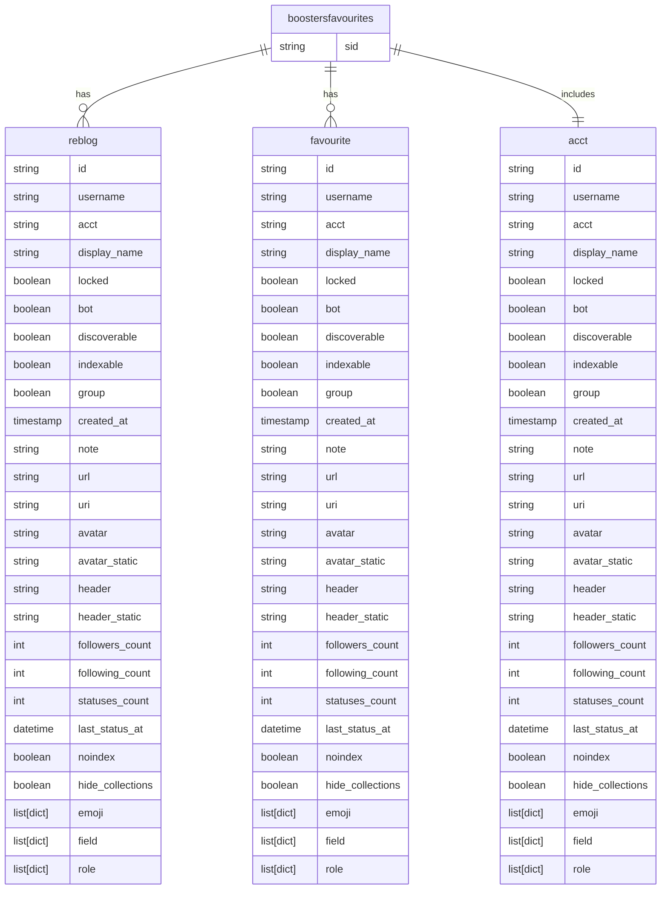
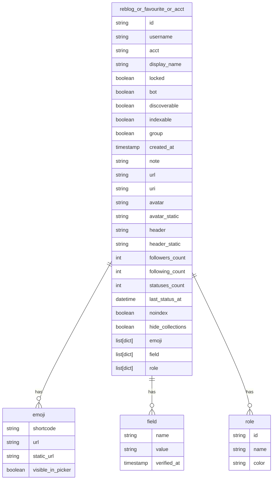

## boostersfavourites.json Description

- 字段结构说明 / Field Structure Overview

    这是一个包含特定 Mastodon 动态（帖子） 在联邦网络中传播轨迹的数据结构，具体字段包括：

    This is a structured object representing the propagation of a specific Mastodon post within the decentralized Fediverse. It includes the following fields:

| 字段名 / Field Name | 类型 / type | 中文说明  | English Description |
| --------------------------------------------------------------------- | ---------- | ------------------- | ------------------- |
| `sid`                                                                 | 字符串 String | 原始帖子的唯一标识符（由 instance + user id 构成） | Unique identifier of the original post (formed by instance + user ID) |            |                                     |
| `reblogs`                                                             | 列表 List    | 所有 **转发（boost）** 该帖子的用户信息 | List of users who boosted the post                                    |            |                                     |
| `favourites`                                                          | 列表 List    | 所有 **点赞（favourite）** 该帖子的用户信息 | List of users who favorited the post                                  |            |                                     |
| `acct`                                                                | 字典 Dict    | 原始发帖用户的账号信息 | Account information of the original poster                            |            |                                     |

- 每个用户对象（reblogs/favourites）的字段说明 / Field Description of Each User Object (in reblogs/favourites)

| 字段名 / Field Name                                                                        | 示例 / Example              | 中文说明                       | English Description |
| -------------------------------------------------------------------------- | ---------------- | ------------------------ | ------------------------ |
| `id`                                                                       | `anon_id_...`    | 匿名化的用户 ID | Anonymized user ID                                                         |                  |                          |
| `username`                                                                 | `anon_name_...`  | 用户名（匿名处理） | Username (anonymized)                                                      |                  |                          |
| `display_name`                                                             | `"thoughtbot"` 等 | 用户公开昵称 | Display name                                                               |                  |                          |
| `note`                                                                     | HTML 格式自我介绍      | 用户兴趣、自我认同、组织归属等 | Self-introduction in HTML, often showing interests, affiliations, identity |                  |                          |
| `followers_count`                                                          | 例如 956           | 粉丝数量（衡量影响力） | Follower count (indicator of influence)                                    |                  |                          |
| `following_count`                                                          | 例如 80            | 关注数量 | Number of users followed                                                   |                  |                          |
| `statuses_count`                                                           | 例如 791           | 总发帖数（活跃度指标）| Total number of posts (activity level)                                     |                  |                          |
| `bot`                                                                      | true / false     | 是否为机器人账户 | Whether the account is a bot                                               |                  |                          |
| `created_at`                                                               | YYYY-MM-DD       | 账号创建时间 | Account creation date                                                      |                  |                          |
| `emojis`                                                                   | 列表 List          | 自定义表情符号，用于展示社群特征 | Custom emojis indicating community traits                                  |                  |                          |
| `fields`                                                                   | 列表（name/value）   | 自定义个人资料字段（如网站、GitHub、位置）| User-defined profile fields (e.g. website, GitHub, location)               |                  |                          |
| `url`, `uri`, `avatar`, `header`                                           | 多为链接             | 用户资料页和媒体头像链接 | Links to profile page and avatar/header images                             |                  |                          |

- acct 字段说明 / Field Description: acct

    字段 acct 是指该条动态的原始发布用户的信息（poster account），结构与 reblogs 和 favourites 中的用户对象一致，字段如下：

| 字段名 / Field Name                | 示例 / Example                | 中文说明                     | English Description                                 |
| ------------------ | ----------------- | ------------------------ | --------------------------------------------------- |
| `id`               | `anon_id_...`     | 用户的匿名化 ID                | Anonymized user ID                                  |
| `username`         | `anon_name_...`   | 用户名（匿名处理）                | Username (anonymized)                               |
| `acct`             | `anon_acct_...`   | 联邦账号名（如 `user@instance`） | Federated account name (e.g., `user@instance`)      |
| `display_name`     | `"balticruby"`    | 显示昵称（通常为组织或用户名）          | Display name (often user/org name)                  |
| `locked`           | `true/false`      | 是否锁定账号（仅允许通过审核后关注）       | Account locked status (requires approval to follow) |
| `bot`              | `true/false`      | 是否为机器人账户                 | Whether this account is a bot                       |
| `discoverable`     | `true/false/null` | 是否可被主动发现                 | Whether discoverable in search/discovery            |
| `indexable`        | `true/false`      | 是否可被搜索引擎索引               | Whether indexable by search engines                 |
| `group`            | `true/false`      | 是否为群组类型账号                | Whether this is a group-type account                |
| `created_at`       | `"YYYY-MM-DD"`    | 账号创建时间                   | Account creation date                               |
| `note`             | HTML 内容           | 用户自我介绍、定位、兴趣等            | User bio in HTML format                             |
| `url`, `uri`       | 链接                | 该账号的主页地址和 URI            | Profile URL and URI                                 |
| `avatar`, `header` | 图片链接              | 用户头像和头图                  | Avatar and header image URLs                        |
| `followers_count`  | 如 `54`            | 粉丝数量                     | Number of followers                                 |
| `following_count`  | 如 `143`           | 关注的用户数量                  | Number of users followed                            |
| `statuses_count`   | 如 `78`            | 发帖总数                     | Total number of statuses/posts                      |
| `last_status_at`   | `YYYY-MM-DD`      | 最后活跃日期                   | Last activity date                                  |
| `hide_collections` | `true/false/null` | 是否隐藏公开收藏                 | Whether public collections are hidden               |
| `noindex`          | `true/false`      | 是否不允许搜索引擎索引              | Search engine indexing preference                   |
| `emojis`           | 列表                | 自定义 emoji 表情             | List of custom emojis                               |
| `roles`            | 列表                | 系统或平台角色                  | System-defined roles                                |
| `fields`           | 列表（对象）            | 个人资料自定义字段（如网站、职位等）       | Custom profile fields (e.g., website, role)         |

